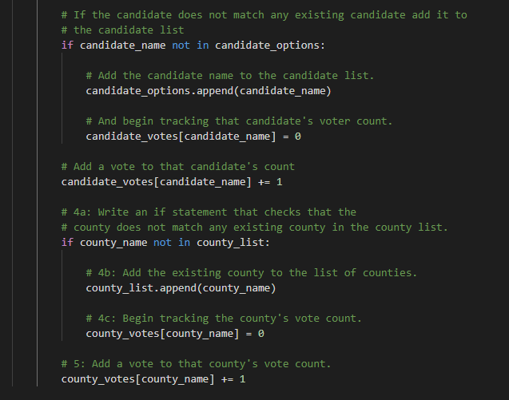

# Election Audit

## Election Audit Overview

This project used Python to assist the Colorado Board of Elections in auditing election results for a United States congressional district. Initially, code was developed to determine the number of votes and the percentage of total votes for the three candidates running in the election to verify the winner. Additional code was developed to investigate the voter turnout in each of the three counties making up the district to determine the county with the highest voter turnout. The Python script for this project was developed in Python 3.8.8 using Visual Studio Code.

### Election Audit Purpose

The overall purpose of this project was to use Python to read data, perform analysis, and write output files in an effort to assist the Colorado Board of Elections in auditing the election results for a U.S. congressional district. Students built upon programming skills learned in the previous module and learned new syntax and methods specific to Python.

## Election Audit Results

The first step in the analysis for this project was to add dependencies and initialize variables, lists, and dictionaries to be used throughout the analysis. Fig. 1 illustrates the Python code for this step.

*Figure 1. Python code dependencies along with variable, list, and dictionary initializations*

Following the initializations, the data file was read in, and the analysis was started as shown in Fig. 2. Notice that the *with* statement is used here to ensure that the file opened in the *with* statement is closed upon exiting the *with* statement. Note that the total number of votes is counted with the *total_votes* variable that is incremented by 1 each time through the *for* loop.

*Figure 2. Code to read in data and begin analysis*

The next section of code, shown in Fig. 3, was used to create lists and dictionaries of candidates and counties and track the votes associated with each candidate and county. This information was used later in the code to calculate vote percentages, determine the county with the highest voter turnout, and verify the winner of the election.

*Figure 3. Populate lists and dictionaries for candidates and counties*

The next step in the analysis process was to perform the remaining calculations and write the data to an output text file that could be reviewed by the Colorado Board of Elections. The code for the first part of this process is shown in Fig. 4. Recall that the total votes was calculated with the code in Fig. 2. Also note that *print()* functions are used throughout the latter part of the Python script to print the results to the terminal for the user running the script.

*Figure 4. Write total vote count to text file*

The total number and percentage of votes per county were calculated, printed to the terminal, and written to the output text file as shown in Fig. 5 using a *for* loop to loop over all counties in the dataset. The results are written using *f-strings* to simplify the Python code, and an *if* statement is used to determine the county with the highest voter turnout. By comparing the number of votes for each county while looping through the *for* loop, the county with the highest voter turnout is easily determined.

*Figure 5. Determine county voting data and write to text file*

The vote count and percentages for each candidate were determined using a similar approach to that outlined above. The Python code to determine the number and percentage of votes along with the winning candidate is shown in Fig. 6.

*Figure 6. Determine candidate voting data and write to text file*

A summary of the findings from this analysis are listed below.

- There were a total of 396,711 votes cast in this congressional election.
- The breakdown of voter turnout for each county in this precinct is shown below.
    - Jefferson County had 10.5% of the total votes cast with 38,855 votes.
    - Denver County had 82.8% of the total votes cast with 306,055 votes.
    - Arapahoe County had 6.7% of the total votes cast with 24,801 votes.
- As indicated above, Denver county had the highest voter turnout in this election with 306,055 votes.
- The breakdown of votes for each candidate in this election is shown below.
    - Charles Casper Stockham received 23.0% of the vote with 85,213 votes.
    - Diana DeGette received 73.8% of the vote with 272,892 votes.
    - Raymon Anthony Doane received 3.1% of the vote with 11,606 votes.
- Diana DeGette won this election with 272,892 votes, or 73.8% of the total vote count.

A screenshot of the terminal output confirming the above conclusions is shown in Fig. 7.

*Figure 7. Terminal output for election analysis Python code*

## Election Audit Summary

The script developed for this project determines vote counts and percentages, identifies the county with the highest voter turnout, and accurately determines the winner of the election based on the popular vote. While the script satisfies its intended purpose, it could be generalized and streamlined to work with any election providing greater utility to the Board of Elections.

Suggestions for future improvements or modifications for this script are listed below.

1. The user could be prompted for inputs to add versatility in this script. For instance, the user could be prompted for file locations so that relative or absolute paths do not need to be specified directly in the code. The current setup could lead to errors if files are moved or the names change. The user could also retrieve specific data for a particular candidate, voting district, ballot type, etc.
2. For the current script, files are opened and output data is written with *for* loops that execute while the output file is open. In an alternative approach, the output data could be written to lists, dictionaries, or variables that could be accessed later to write to files or perform further analysis. Modifying the script in this manner would make it very easy to write specific data and analysis results to an output file. This would enable the user to generate more thorough, organized, and tailored reports for the Board of Elections. For instance, the user could only present data for the top two or three candidates in fields where there may be many candidates running for office.
3. To improve the ability for future developers to enhance or debug this script for different elections, the variable naming convention could be modified. Currently, counties are assumed as the delineating regions within the voting district, but this is not the case for all elections.
4. Another potential improvement in this script would be to access the header row to determine the columns of data that correspond to the voter ID, candidate name, region, etc. In the current script, this is hard-coded as numerical indices, which could become problematic if the organization of the data changes for different types of elections.
